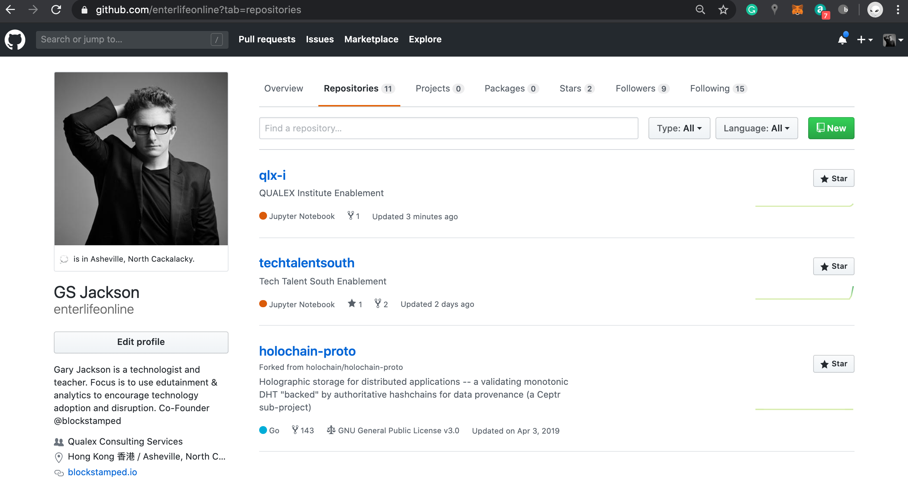
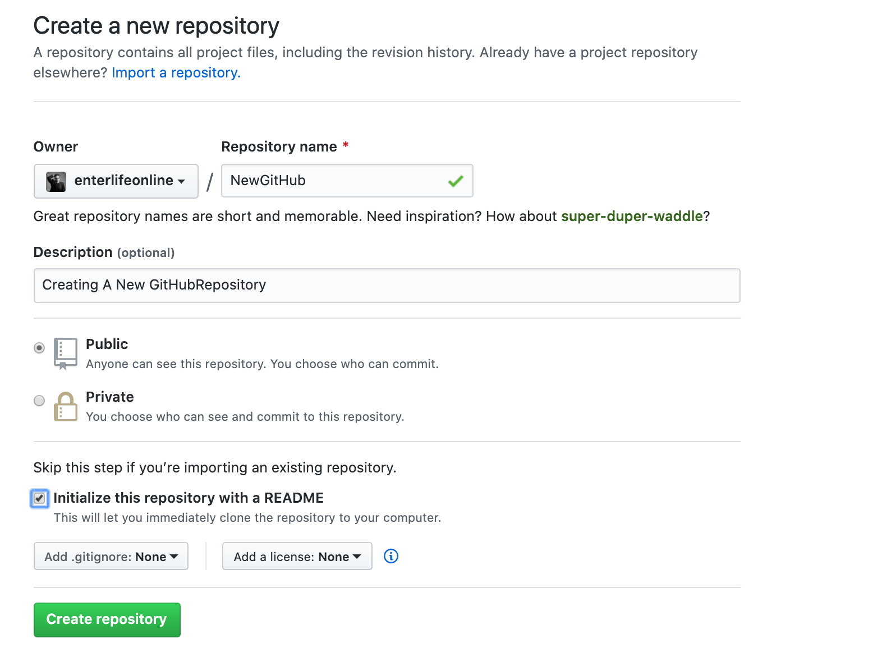
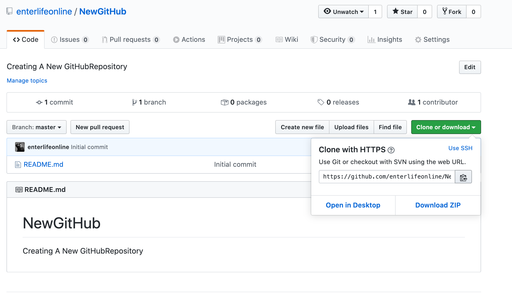

# Tech Talent South

## How To Submit Your Exercises

[Watch Video](https://youtu.be/GCd4auHwZZY)

[](https://www.youtube.com/watch?v=GCd4auHwZZY)

- - - 

## Installation Required

In order to use Git Bash commands from command line, you need to install Git based on the operating system you are using: 

- [Git For Windows](https://gitforwindows.org/)
- [Git For Mac OS](https://git-scm.com/download/mac)

---

## Creating Github Repository

1. Create a New Github Repository by clicking on the green button entitled "New".



2. When Creating A New Repository, be sure to give it a unique name, description, choose Public, and click on the box to Initialize this repository with a README.  Finally, click on the green button entitled **"Create Repository"**.



3. Upon completion, click on the green button entitled **"Clone or Download"** but DO NOT download.  



## Initializing New Github Repository

Simply click on the cut and paste icon right of the URL to copy the Git URL, then from command line submit the following commands: 

```
    > cd Documents
    > cd Repositories
    > git clone https://github.com/enterlifeonline/NewGitHub.git
    > cd NewGitHub
    > touch README.md
    > git remote add NewGitHub https://github.com/enterlifeonline/NewGitHub.git
    > git add *
    > git commit -m "Initialized NewGitHub"
    > git push
```

## Adding Contents from Your Computer To New Github Repository

```
    > cd Documents
    > cd Repositories
    > cd NewGitHub
    > git add *
    > git commit -m "Put Any Comments Here About New Contents"
    > git push
```
- - -

## Mastering Github

> GitHub is often used as a basic Git host, but its platform has so much more to offer.
> From simple and powerful issues and pull requests, to advanced features for power users
> and integrators, it’s a tool worth knowing well in its own right. This session will
> review everything you need to know to master collaboration with GitHub, from best
> practices for GitHub Issues and how it represents basic Git concepts, to hidden features
> and the tools enabling its developer ecosystem.

- Git Hosting
    - Create Repository
        - With README
        - With [.gitignore](https://github.com/github/gitignore)
        - With [open source license](http://choosealicense.com/)
        - Without inital commit (can't clone)
    - Watch
        - Not watching, Watching, Ignoring
        - [Notifications Settings](https://github.com/settings/notifications)
        - [User Watching List](https://github.com/watching)
    - Fork
        - Complete copy of the Repository
        - Can fork to user or organization
        - Part of parent project's "Network"
        - Can easily open Pull Requests to propose contributions
    - Code
        - Find file
            - Type <kbd>t</kbd> to activate
            - (Type <kbd>?</kbd> to see all keyboard shortcuts)
        - Search
            - Search in code, commit messages, issues
            - Scope: repo, organization or global
        - Files

            ```
            {owner}/{repo}/tree/{commit-ish}/{path/to/tree}
            ```

        - Content

            ```
            {owner}/{repo}/blob/{commit-ish}/{path/to/blob}
            ```

        - Raw Download

            ```
            {owner}/{repo}/raw/{commit-ish}/{path/to/blob}
            ```

        - Blame

            ```
            {owner}/{repo}/blame/{commit-ish}/{path/to/blob}
            ```

        - History

            ```
            {owner}/{repo}/commits/{commit-ish}/{path/to/blob}
            {owner}/{repo}/commits/{commit-ish}/{path/to/tree}
            ```

            - Filter by query string ([example](https://github.com/dahlbyk/posh-git/commits/master?since=2015-12-25&until=2016-01-01))
                - `author=dahlbyk`
                - `since=2015-12-25`
                - `until=2016-01-01`
        - Single Commit

            ```
            {owner}/{repo}/commit/{commit-ish}
            {owner}/{repo}/commit/{commit-ish}.diff
            {owner}/{repo}/commit/{commit-ish}.patch
            ```

            - Containing branches and PRs
            - Can comment on lines and commit, but generally prefer comment in PR
            - Add `?w=1` to URL to ignore whitespace in diff
              ([example](https://github.com/dahlbyk/posh-git/commit/85ab3d7016a080c1927443524b4e3044eb9e588c?w=1))
        - Modification
            - New File / Upload, Edit File, Delete
            - Commit to current branch _or_ create new branch for Pull Request
        - Hacking `commit-ish`
            - Previous commit: `master~`
            - 100 commits ago: `master~100`
            - Previous branch heads (`reflog`)
                - `master@{1}`
                - `master@{yesterday}`
                - `master@{2016-01-01}`
            - More at `git help revisions`
        - Linking
            - Type <kbd>y</kbd> to resolve `commit-ish` to canonical/permanent link
            - Click a line number to highlight and link to that line (`#L123`)
            - Hold Shift and click another line to highlight/link range (`#L123-L456`)
    - Branches
        - Can create and delete branches
        - General Git Tips
            - "Remote tracking branch" is what was on GitHub at last `fetch`/`pull`
                - `refs/remotes/<remote>/<branch>` AKA `<remote>/<branch>`
                - Configured with `remote.<name>.fetch`
                    - `+refs/heads/*:refs/remotes/origin/*`
                    - GitHub PR heads: `+refs/pull/*/head:refs/remotes/origin/pr/*`
                - Deleted branches' tracking refs are not automatically deleted
                    - `git remote prune origin`
                    - `git fetch --prune`
                    - Always want to prune?
                        - `git config remote.<name>.prune true`
                        - `git config fetch.prune true`
            - Start work on a remote branch

                ```
                > git checkout -t origin/my-branch
                On branch my-branch
                Your branch is up-to-date with 'origin/my-branch'.
                nothing to commit, working tree clean
                ```

                - Or, if `<branch>` exists on only one remote: `git checkout <branch>`
                - Tracking lives in config

                    ```
                    git config branch.master.remote         # origin
                    git config branch.master.merge          # refs/heads/master
                    ```

            - To set up tracking when pushing new branch

                ```
                > git push -u origin HEAD
                Total 0 (delta 0), reused 0 (delta 0)
                To https://github.com/dahlbyk/my-repo.git
                * [new branch]      HEAD -> my-branch
                Branch my-branch set up to track remote branch my-branch from origin.
                ```

                - Using `HEAD` pushes current branch to branch of same name
                    - `git config --global alias.pc "push -u origin HEAD"`
                - Can also use branch name to push any branch to branch of same name
                - Can also use `source:destination` to push to branch of different name
                    - `git push origin my-branch:my-awesome-branch`
                - Have a convention to prefix branches with username?
                    - `git config alias.pc = !git push -u origin HEAD:dahlbyk/$(git symbolic-ref --short HEAD)`
                - To delete branch, `source` is empty: `git push origin :my-branch`
        - Default Branch
            - Shown when repo is opened
            - Set as `<remote>/HEAD` on `git clone`
                - Handy for global aliases to not assume `master`
                - `git config --global alias.new "log --oneline --decorate --reverse origin.."`
        - Protected Branches
            - Disables force-pushes to this branch and prevents it from being deleted.
            - (optional) Require pull request reviews before merging
            - (optional) Require status checks to pass before merging
        - Compare

            ```
            {owner}/{repo}/compare/{revision range}
            {owner}/{repo}/compare/{revision range}.diff
            {owner}/{repo}/compare/{revision range}.patch
            ```

            - `revision range` can either be a range (`<base>...<head>`)…
            - …or a `commit-ish`, equivalent to `<default>...<head>`
            - If `<base>` and `<head>` are both branches, can open a Pull Request
            - `<base>` and `<head>` can include a fork prefix, e.g.
              [`dahlbyk:master...coridrew:tfs`](https://github.com/dahlbyk/posh-git/compare/dahlbyk:master...coridrew:tfs)
- Issues
    - [GitHub-Flavored Markdown](https://guides.github.com/features/mastering-markdown/)
        - Syntax highlighting
        - Task lists
        - Auto-linking
            - Commit SHAs (`deadbeef` or `owner/repo@deadbeef`)
            - Issue/PR references (`#1`, `repo#2`, `owner/repo#3`)
            - Parsing of GitHub URLs (e.g. "#1 (comment)")
    - Issue/PR mentions in issues/PRs/commits show up as references
        - Build a graph of inter-related issues
    - Milestones (due date, completion %)
    - Labels
    - Assignees
        - New: multiple assignees
- Pull Requests

    ```
    {owner}/{repo}/pull/{number}
    {owner}/{repo}/pull/{number}.diff
    {owner}/{repo}/pull/{number}.patch
    ```

    - Formerly "an issue attached to a branch"
        - Could even use API to convert issue to PR…but you shouldn't
    - Commits
        - Used to link away to raw commit
            - comments on commit/lines didn't work well; lost after `rebase`
        - Now commits keep PR context, comments work much better
    - Changes
        - Comment per line
        - Standalone or collected in a Review
        - Can limit to changes since last review, or specific commit
    - Deployments
        - [Heroku Review Apps](https://devcenter.heroku.com/articles/github-integration-review-apps)
    - Checks
        - CI
        - Linting
        - Review Approval
- Projects
    - Add issues or notes to columns
    - No workflow (e.g. Closed move to last column)
    - Also check out [HuBoard](https://huboard.com/)
- Repo Settings
    - Merge button
        - Merge commits
        - Squash merging (noooooooo)
        - Rebase merging (finally)
        - Want: rebase then merge commit

            ```
            --*---------*------------*--
               \       / \          /
                *--*--*   *--*--*--*
            ```

    - GitHub Pages
        - Not just gh-pages branch any more
        - http://up-for-grabs.net/ is 100% static and GitHub-backed
    - [Webhooks](https://developer.github.com/webhooks/)
    - [Integrations](https://github.com/integrations)
        - "Services" are obsolete
- For Developers
    - API [v3](https://developer.github.com/v3/)
        - [OAuth](https://developer.github.com/v3/oauth/)
    - [GraphQL](https://developer.github.com/early-access/graphql/) Early Access
        - Limited scope, but used internally for new features (e.g. Projects)
    - [Integrations](https://developer.github.com/early-access/integrations/) Early Access
        - Different from integrations directory
        - Primarily targeting "non-user" users, e.g. no more CI admin user
- Gist
    - One or more files
    - Repository
        - No directories - blocked on push
    - https://bl.ocks.org/
